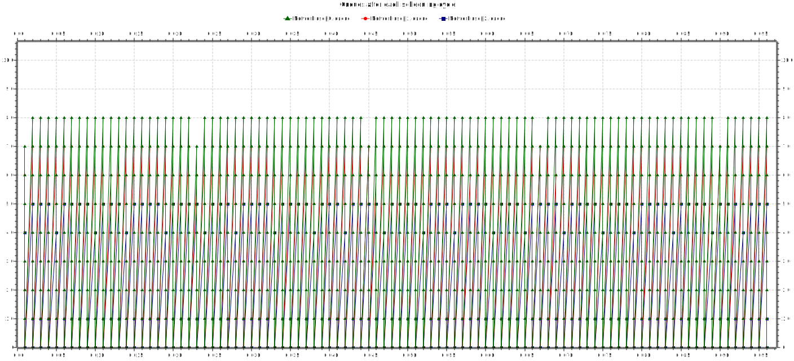
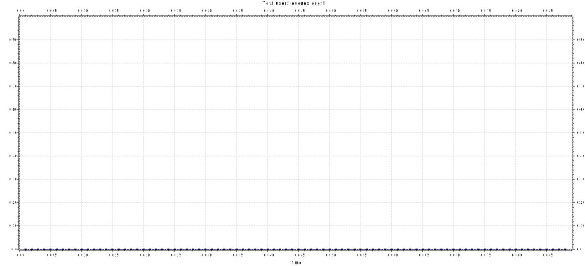
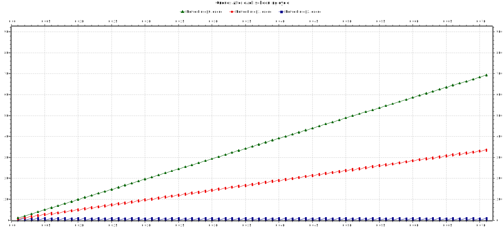

# 3 users scenario - Proportionally Fair algorithm

## Setup

**Network** consisting of a **scheduler**, **users** and a **sink**.

Each **user** consists of a **generator** and a **queue**.
  
For this analysis, we chose the following weights for the users: **w = [1, 2, 3]**.

The scheduler runs every **1ms** and has the task of distributing the **30 channels** between the users. 

## 90% network load

Each user gets to send its messages. There are free channels remaining after each scheduling cycle. The sum of the users' queue lengths is 0.

 
 
 

## 100% network load

Each user gets to send its messages. There are barely any free channels remaining after each scheduling cycle. The sum of the users' queue lengths is 0.

 
 
 

## 150% network load

More "important" users (those with higher weights) get to send their messages. There aren't any free channels remaining after each scheduling cycle. The sum of the users' queue goes up linearly.

 
 
 